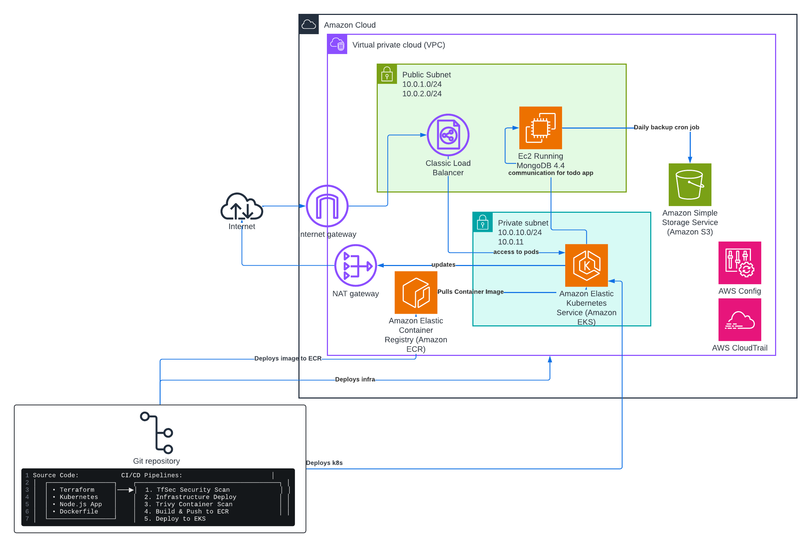

# Wiz Technical Exercise

Built this in my personal AWS account to show some common cloud security issues that tools like Wiz would catch. Basically took what I know from security and put it into actual infrastructure code.

## What's In Here

I set up a bunch of intentional security issues that are pretty common:
- **Public S3 bucket** - database backups anyone can download
- **Old VM software** - Ubuntu 20.04 and MongoDB 4.4 (both way outdated)
- **SSH open to the world** - classic mistake
- **Way too many IAM permissions** - VM can basically create anything
- **Kubernetes over-privileges** - service account has admin rights to everything

Kept it cheap - runs about $4/day in my AWS account.

## Architecture Overview



Pretty simple setup - web app in Kubernetes talks to MongoDB, backs up to S3. Everything has security issues on purpose.

## How to Run This

### GitHub Actions (easiest way)
1. Fork this repo
2. Set up your AWS secrets in GitHub
3. Go to Actions tab and run "Infrastructure Deployment"
4. Wait about 15 minutes
5. Run "Container Build & Kubernetes Deploy" (this builds and deploys the app automatically)
6. Done - app is running

### Manual way
```bash
cd terraform
terraform init
terraform apply

# Connect to the cluster
aws eks update-kubeconfig --region us-east-1 --name wiz-exercise-dev

# Test it
./scripts/test-infrastructure.sh
```

## Security

### Issues (on purpose)
- Public S3 bucket with database backups
- Old Ubuntu and MongoDB versions on the VM
- SSH open to everyone
- Way too many IAM permissions
- Kubernetes service account with admin rights

### Controls (the good stuff)
- AWS Config rules to catch public buckets/ssl/open ssh
- CloudTrail for audit logs
- IAM permission boundary to prevent deletion of VPC
- Security scanning in the CI/CD pipeline

## What's Where

```
├── terraform/           # Infrastructure code
├── app/                # Node.js app with wizexercise.txt
└──k8s/                # Kubernetes configs
```

## For the Demo

```bash
# Check that everything is running
kubectl get pods -n wiz
kubectl get services -n wiz

# Check that wizexercise.txt is there
POD_NAME=$(kubectl get pods -n wiz -l app=wiz-todo-app -o jsonpath='{.items[0].metadata.name}')
kubectl exec -n wiz $POD_NAME -- cat /app/wizexercise.txt

# Test the app endpoints
kubectl exec -n wiz $POD_NAME -- wget -qO- http://localhost:3000/health
kubectl exec -n wiz $POD_NAME -- wget -qO- http://localhost:3000/api/info

# Get the external URL
ELB_URL=$(kubectl get service wiz-todo-service -n wiz -o jsonpath='{.status.loadBalancer.ingress[0].hostname}')
echo "App URL: http://$ELB_URL"
curl "http://$ELB_URL/health"
```

## Cleanup

```bash
cd terraform
terraform destroy
```
